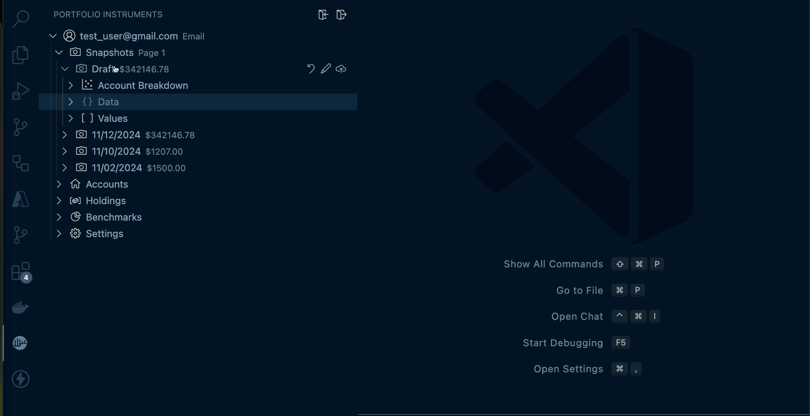
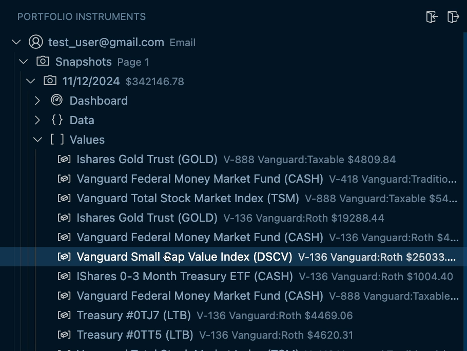

# Change Log
## v2.0.0
### Overview
This release migrates the extension to support the [v2 API release](https://github.com/MicroFish91/portfolio-instruments-api/releases). In addition to the API migration, this version includes quality of life improvements such as refresh/collapse all functionality, support for managing deprecated resources, and various bug fixes to improve the overall user experience.

### Added
* Added refresh and collapse all support ([#26](https://github.com/MicroFish91/portfolio-instruments-ext/pull/26))
* Added a command to restore deprecated items ([#25](https://github.com/MicroFish91/portfolio-instruments-ext/pull/25))
* Added toggle for showing deprecated resources, deprecated resources shown at the end ([#23](https://github.com/MicroFish91/portfolio-instruments-ext/pull/23))

### Changes
* Updated snapshots to support v2 API ([#16](https://github.com/MicroFish91/portfolio-instruments-ext/pull/16))
* Updated benchmark creation and updates for v2 API ([#15](https://github.com/MicroFish91/portfolio-instruments-ext/pull/15), [#17](https://github.com/MicroFish91/portfolio-instruments-ext/pull/17))
* Respect `value_order` field for snapshots v2 instead of a client-side cache ([#21](https://github.com/MicroFish91/portfolio-instruments-ext/pull/21))

### Fixes
* Don't show the client-side ordering id for tree items ([#22](https://github.com/MicroFish91/portfolio-instruments-ext/pull/22))
* Refresh the snapshot item whenever any of the underlying snapshot_values change ([#19](https://github.com/MicroFish91/portfolio-instruments-ext/pull/19))

### Engineering
* Added Docker Compose configuration for easier local development

## v1.2.0
### Added
* Added a way to graph your snapshots / net worth over time

### Changed
* Show account name when editing through the snapshot code lens
* Order liquidity items from most to least value
* Order maturation date items by maturation date

## v1.1.0
### Added
* Added live code lens for the snapshot draft editor
      
    

* Added drag and drop support for most resources
      
    

## v1.0.1
### Added
* Added extension icon to marketplace

## v1.0.0
Official release.