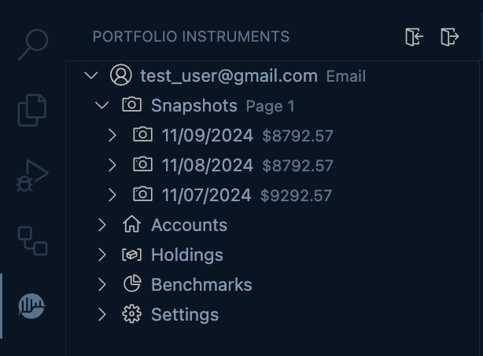
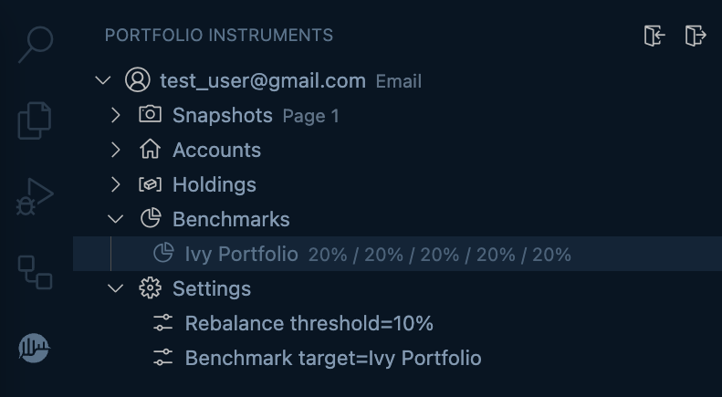
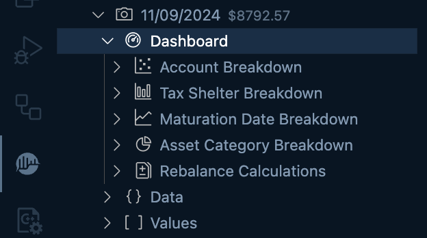
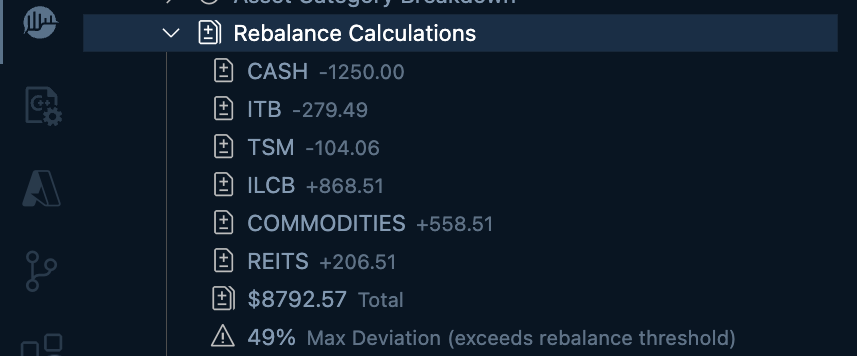

#  Portfolio Instruments Extension

This is the Portfolio Instruments VS Code client extension. It was built to simplify the management of passive investment portfolios. It enables users to input portfolio data and receive automated rebalancing recommendations based on benchmark criteria, eliminating the need for manual spreadsheet tracking. This API streamlines the process of calculating rebalancing requirements, offering a comprehensive solution for portfolio management. Additionally, users can efficiently query their accounts and assets to gain insights into their holdings across different tax shelters, financial institutions, liquidity levels, and more.

<b>Note</b>: This project is mostly for my personal use, however, you are free to use it as well if you find it useful.

## Key Features
* 📷 <u>Snapshot Tracking</u>: Capture and monitor portfolio snapshots at different points in time.
  

* 📁 <u>Benchmark Portfolios</u>: Provide portfolio benchmarks to monitor your portfolio snapshots against.
  

* 📈 <u>Rebalance Calculations</u>: Automatically generate rebalancing recommendations based on your chosen benchmarks.
  

## 🔗 Useful Links

* [Portfolio Instruments API](https://github.com/MicroFish91/portfolio-instruments-api)
* [Modern Portfolio Theory](https://en.wikipedia.org/wiki/Modern_portfolio_theory)
* [Portfolio Charts](https://portfoliocharts.com/)